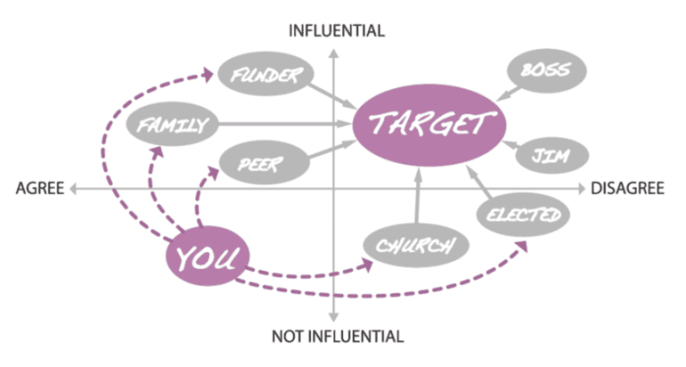

# Power

figuring out who has it and how to influence them

## Selectorate Theory

-   Most research organizations aren't democracies
    -   Faculty and students don't elect the university president
-   [[Bueno2022](b:Bueno2022)]: *The Dictator's Handbook*
    -   [Nominal selectorate](g:nominal-selectorate): those who have the right to have a say
    -   [Real selectorate](g:real-selectorate): those who actually cast a vote
    -   [Winning coalition](g:winning-coalition): those whose votes produce victory
-   Humorous but serious advice:
    1.  The smaller the winning coalition, the fewer people the dictator needs to satisfy to remain in control.
    1.  The larger the selectorate, the easier it is to replace dissenters.
    1.  Extract as much wealth as you can without provoking rebellion or recession.
    1.  Give your essential supporters just enough rewards to keep them loyal.
    1.  Do not reward your supporters too well or they will become a threat.

### Exercise

1.  Who makes funding and work allocation decisions in your institution in theory?
1.  Who makes those decisions in practice?

## Power Mapping

-   Graphical tool to identify people to target and how to reach them
-   Steps:
    1.  Identify the (specific) people who can actually make the change you want
    2.  Plot where (you believe) they stand on the issue (two axes)
    3.  Add people who can directly influence the people you identified in step 1
    4.  *Label the connections*
    5.  Repeat steps 3 and 4 for the people you just added until you and your team are part of the diagram
    6.  Highlight connections you believe are most likely to be productive

## Exercise

1.  Pick a small but desirable change in your local environment.
1.  In a group, create a power map.

  

FIXME #3: replace diagram above with one specific to open science organizations
